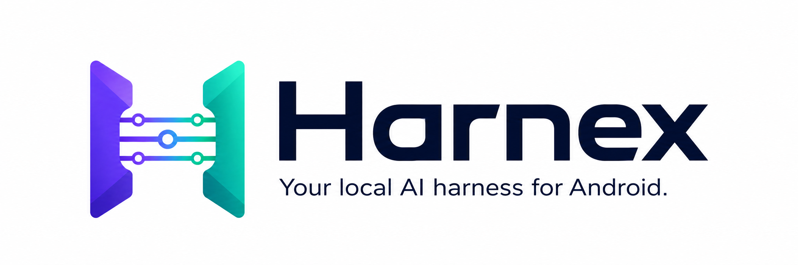
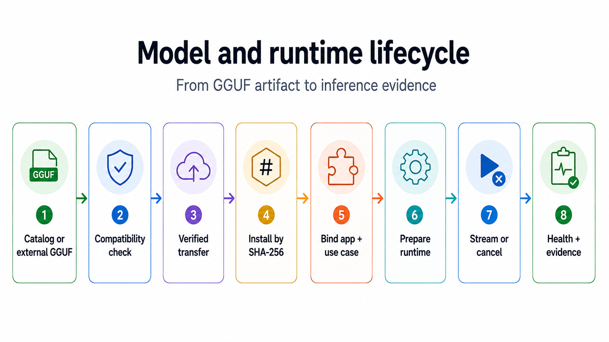

<p align="center">
  
</p>

<h1 align="center">Harnex</h1>

<p align="center">
  <strong>Your local AI harness for Android.</strong><br>
  Run and manage local LLMs once, then expose them to Android apps through one controlled boundary.
</p>

<p align="center">
  <a href="https://daniele21.github.io/">Mission</a> ·
  <a href="#why-harnex-exists">Why</a> ·
  <a href="#what-you-can-do-today">Today</a> ·
  <a href="#how-to-use-it">How to use it</a> ·
  <a href="#how-it-works">How it works</a> ·
  <a href="#current-status-and-limits">Status</a> ·
  <a href="docs/README.md">Docs</a>
</p>

<p align="center">
  <a href="https://github.com/daniele21/android-local-llm-harness/actions/workflows/validate.yml"></a>
  
  
  <a href="LICENSE"></a>
</p>

## Why Harnex exists

I'm exploring [how much AI can move from the cloud to infrastructure and devices we control](https://daniele21.github.io/), and where Local, Hybrid or Cloud actually makes sense.

Harnex tackles the Android side of that question:

> **Can local AI become a shared Android capability instead of a native stack rebuilt inside every app?**

Without a shared layer, each app has to deal with models, GGUF files, JNI, runtime lifecycle, memory, cancellation and diagnostics on its own.

Harnex puts those concerns behind one Android-owned boundary.

## What you can do today

Harnex is already a usable Local AI host and engineering console for Android.

You can:

- discover, import, verify and install supported GGUF models;
- run local generation, streaming and cancellation;
- bind applications and use cases to explicit model/runtime policies;
- let consumer apps call the shared runtime through the Consumer Android SDK and Binder;
- inspect latency, throughput, memory, thermal state, logs and request timelines;
- run health, integrity, generation and evaluation workflows;
- keep prompts and generated content out of normal telemetry.

The current product surfaces are **Overview, Playground, Applications, Performance, Models, Diagnostics and Settings**.



## How to use it

### 1. Run Harnex

Prerequisites:

- JDK 17;
- Android SDK API 36 and Build Tools 36.0.0;
- Android NDK 28.2.13676358;
- an ARM64 Android emulator or device;
- Gradle through the committed wrapper.

```bash
git clone https://github.com/daniele21/android-local-llm-harness.git
cd android-local-llm-harness
bash scripts/run-emulator-debug.sh --app phone-test
```

The script installs and launches Harnex. It does not create or boot an emulator.

### 2. Add a model

Open **Models** and either:

- download a supported catalog model; or
- import a compatible local GGUF file.

Model binaries, credentials and signing material must not be committed to the repository.

### 3. Try local inference

Open **Playground**, choose the configured use case and run a prompt. Harnex handles model preparation, execution, cancellation and runtime evidence.

### 4. Use Harnex from another Android app

Consumer apps integrate the versioned Consumer Android SDK and call Harnex over Binder. The app owns its product workflow; Harnex keeps model, runtime and residency ownership.

See [`docs/shared-runtime/consumer-android-sdk.md`](docs/shared-runtime/consumer-android-sdk.md) for the current integration contract.

For build, emulator, signing and device details, see [`docs/android-build-and-run.md`](docs/android-build-and-run.md).

## How it works

```text
Android app
    |
    v
Consumer Android SDK
    |
    v
Binder
    |
    v
Harnex host
    |
    +--> model store / use-case policy
    +--> runtime scheduling / lifecycle
    +--> observability / evaluation
    |
    v
llama.cpp + local GGUF model
```

Harnex keeps a few boundaries explicit:

- **Consumer apps own the workflow.** They should not own GGUF files, JNI or Harnex runtime internals.
- **Harnex owns model and runtime policy.** Model resolution is explicit; there is no silent model substitution.
- **Model states stay separate.** Downloaded, installed, selected and resident do not mean the same thing.
- **Runtime limits are visible.** Scheduling, cancellation, memory pressure and cleanup are first-class behavior.
- **Evidence stays honest.** Emulator evidence is not presented as physical-device or production evidence.

For the full architecture, see [`docs/architecture.md`](docs/architecture.md) and the accepted [`docs/adr/README.md`](docs/adr/README.md).

### Repository map

The README stays product-first, but the main implementation owners remain easy to find:

| Area | Main paths |
| --- | --- |
| Public contracts and runtime | `core/contracts`, `core/runtime-core` |
| Models | `models/model-profile`, `models/model-store`, `models/model-catalog`, `models/model-download`, `models/model-install` |
| Native backend | `backends/llama-cpp` |
| Observability | `observability/in-memory-store`, `observability/health-engine`, `observability/android-resource-probe`, `observability/benchmark-engine` |
| Embedded transport | `transports/in-process` |
| Product surfaces | `apps/local-llm-phone-test`, `apps/local-llm-console`, `apps/device-test-runner`, `ui/design-system` |

`settings.gradle.kts` is the authoritative module list.

## Current status and limits

Harnex is an active engineering project, not a production-ready Android AI platform.

Today:

- the Android product and control plane are integrated;
- shared runtime and Consumer/Binder boundaries are implemented;
- product support is currently curated around Qwen3.5 dense 0.8B and 2B;
- background/process lifecycle hardening is integrated and still being completed with cross-repository evidence;
- representative physical-device gates are still required for several release, memory, thermal and lifecycle claims.

The exact integrated state and blockers live in [`docs/current-state.md`](docs/current-state.md).

## Documentation

| Need | Start here |
| --- | --- |
| Current state | [`docs/current-state.md`](docs/current-state.md) |
| Architecture | [`docs/architecture.md`](docs/architecture.md) |
| Consumer SDK | [`docs/shared-runtime/consumer-android-sdk.md`](docs/shared-runtime/consumer-android-sdk.md) |
| Android build and run | [`docs/android-build-and-run.md`](docs/android-build-and-run.md) |
| Physical-device testing | [`docs/device-e2e-testing.md`](docs/device-e2e-testing.md) |
| Roadmap | [`docs/roadmap.md`](docs/roadmap.md) |
| Documentation index | [`docs/README.md`](docs/README.md) |

## Develop and validate

Contributors work from `dev` and follow [`AGENTS.md`](AGENTS.md).

For documentation-only changes, use the repository documentation guards. For implementation changes, run the narrowest checks that cover the affected boundary before expanding validation.

## License

MIT. See [`LICENSE`](LICENSE).

Built by [Daniele Moltisanti](https://daniele21.github.io/) as part of a broader effort to find the Local / Hybrid / Cloud boundary with evidence, not ideology.
