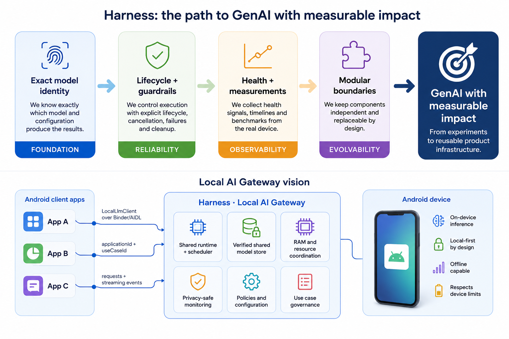
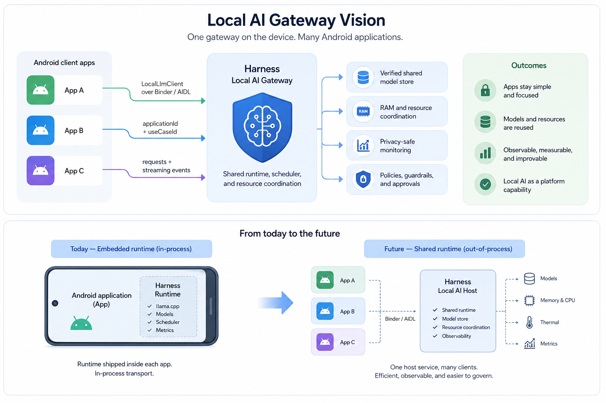
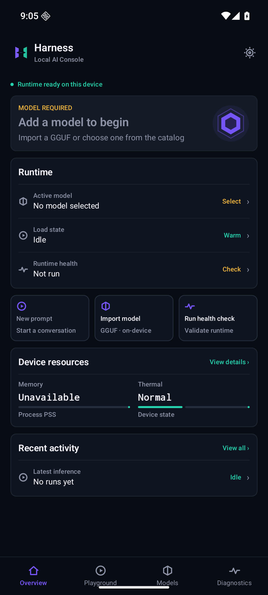
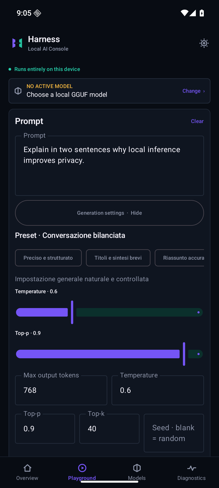
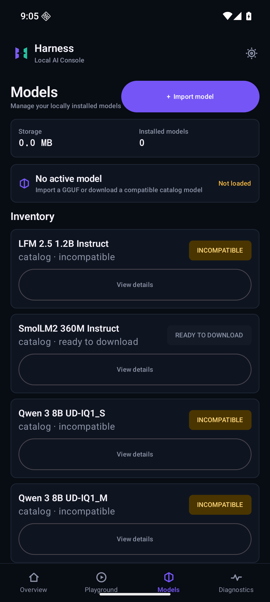
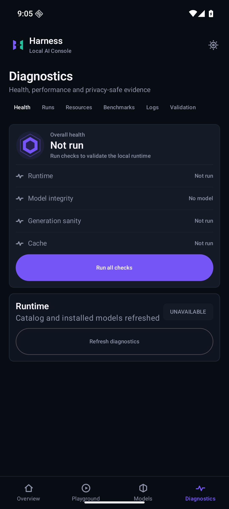
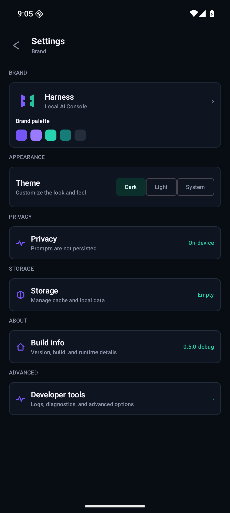

<p align="center">
  
</p>

<h1 align="center">Android Local LLM Harness</h1>

<p align="center">
  <strong>Local AI Gateway for Android</strong><br>
  One gateway. Many Android applications.<br>
  A shared on-device LLM runtime, model plane, and control plane—so Android teams can build local AI features without rebuilding the AI infrastructure inside every app.
</p>

<p align="center">
  <a href="https://daniele21.github.io/">Mission</a> ·
  <a href="#local-ai-gateway-vision">Vision</a> ·
  <a href="#values-and-opportunities">Opportunities</a> ·
  <a href="#where-we-are-today">Today</a> ·
  <a href="#how-it-works">Architecture</a> ·
  <a href="#run-it">Run it</a> ·
  <a href="docs/api-usage.md">Embedded API</a>
</p>

<p align="center">
  <a href="https://github.com/daniele21/android-local-llm-harness/actions/workflows/validate.yml"></a>
  
  
  <a href="LICENSE"></a>
</p>

## Why this exists

My mission is to [scale AI, GenAI, and Data Science with impact](https://daniele21.github.io/): move beyond isolated demos and turn AI into an understandable, measurable, reusable capability.

The vision behind Harness is that local AI should become an Android platform capability, not a native stack that every application team must assemble and maintain independently.

Harness aims to become the device's **Local AI Gateway**: applications ask for an approved AI use case, while one host owns the native runtime, shared models, resource coordination, and operational visibility.

The end state is intentionally bigger than an LLM chat application:

- Android apps gain local inference without packaging `llama.cpp`, JNI, or GGUF artifacts;
- models and scarce device resources can be managed once and reused across authorized clients;
- every use case remains explicit, observable, and independently measurable;
- local AI can evolve from individual experiments into reusable product infrastructure.



_The final vision: turn explicit, measurable local inference into reusable Android product infrastructure._

## Values and opportunities

Harness is designed around values that make local AI useful beyond a technical demonstration.

| Value | What it means | Opportunity it creates |
| --- | --- | --- |
| **Local-first control** | Inference runs on the device and normal telemetry excludes prompts and generated output | Offline-capable and privacy-sensitive product experiences with a narrower external data surface |
| **Reuse instead of duplication** | A future host can own one verified model store and coordinate runtime resources | Multiple apps can use local AI without each shipping duplicate models, native libraries, and lifecycle code |
| **Evaluation before confidence** | Health, timelines, latency, throughput, memory, thermal state, and benchmarks are first-class | Teams can compare models and configurations using evidence tied to the real device and use case |
| **Guardrails that enable delivery** | Model bindings, integrity, cancellation, failures, and cleanup are explicit | Safer iteration and fewer hidden runtime assumptions when moving from PoC to product |
| **Open, replaceable boundaries** | Product contracts are independent from `llama.cpp`, Android UI, and transport details | Backends and deployment topology can evolve without rewriting every client application |
| **Shared operational visibility** | The gateway vision includes one privacy-conscious control plane | Usage, health, capacity, and model behavior can be understood across local AI applications |

This opens several product opportunities:

- **For Android developers:** add summarization, extraction, assistance, classification, or domain workflows through a lightweight client instead of becoming LLM-runtime experts.
- **For product teams:** select an explicit model and policy per use case, then measure whether the local experience delivers the intended value.
- **For platform teams:** govern model distribution, compatibility, lifecycle, and device capacity from one boundary.
- **For offline or sensitive contexts:** keep inference available when cloud access is undesirable, unavailable, or too slow—subject to the exact device and model capability.
- **For model evaluation:** compare GGUF models, quantizations, prompts, and runtime policies with consistent diagnostics before standardizing them for client apps.

## Local AI Gateway vision

The target product is a **Local AI Gateway for Android**. Other Android applications integrate a lightweight, backend-neutral client and connect to a Harness host service instead of embedding `llama.cpp`, JNI libraries, GGUF files, and model-management logic in every APK.

In that target architecture, Harness will:

- expose local generation, streaming, cancellation, and typed failures to authorized Android client apps;
- resolve each request explicitly through `applicationId + useCaseId`, without silently substituting a model;
- download, verify, install, deduplicate, update, and remove shared GGUF artifacts once at the host boundary;
- coordinate model RAM residency, contexts, request scheduling, memory pressure, and cleanup across clients;
- provide one control plane for usage, health, latency, throughput, memory, thermal state, logs, and benchmarks;
- keep client APKs independent from `llama.cpp`, JNI handles, GGUF storage paths, and backend-specific lifecycle code.

This embedded-first sequence is deliberate: the shared host should reuse the same tested runtime core, while measurements must first show that cross-application model or RAM deduplication justifies Android service and IPC complexity. See [ADR 0010](docs/adr/0010-model-aware-embedded-first.md).

## Strategy: from console to gateway

The strategy is to prove the difficult runtime and model-management foundations in a real Android product surface before introducing cross-application IPC and shared ownership.



_Today the runtime is embedded in one application; the target is one protected host service serving many clients._

This sequence keeps each step useful on its own:

1. **Prove the data plane:** model distribution, storage, inference, cancellation, cleanup, diagnostics, and real-device behavior.
2. **Stabilize the contract:** preserve the same `LocalLlmClient`, explicit application/use-case identity, and backend-neutral domain model.
3. **Move ownership behind the gateway:** introduce protected Binder/AIDL transport and a lightweight client integration.
4. **Unlock shared value:** coordinate models, RAM, scheduling, health, and monitoring across authorized Android applications.

## Where we are today

**Harness is currently a tangible Local AI Console for Android.** It is not yet the cross-application gateway, but it already turns the underlying runtime into a usable product for managing, exercising, measuring, and validating local LLMs on one device.

The current console lets a user or developer:

- discover or import GGUF models, check compatibility, verify integrity, install them, and select an explicit model;
- configure prompts and generation policies, run streaming inference locally, and cancel work cooperatively;
- inspect request timelines, time to first token, decode throughput, memory, thermal state, logs, and benchmark history;
- run health, model-integrity, generation-sanity, resource, and validation workflows explicitly;
- examine the same contracts, lifecycle, scheduling, and evidence model that the future gateway will expose to other applications.

That is already a practical result: Harness can be used as an on-device LLM evaluation and engineering console, while simultaneously de-risking the final gateway architecture.

> **Current boundary:** the runtime is still embedded and in-process inside the connected Harness application. Other Android apps cannot connect to a shared Harness IPC service yet and must not assume that Binder/AIDL, cross-application model sharing, or centralized RAM ownership is available.

The five connected surfaces make that current milestone visible:

<table>
  <tr>
    <th>Overview</th>
    <th>Playground</th>
    <th>Models</th>
  </tr>
  <tr>
    <td align="center"><a href="docs/assets/readme/harness-overview.png"></a></td>
    <td align="center"><a href="docs/assets/readme/harness-playground.png"></a></td>
    <td align="center"><a href="docs/assets/readme/harness-models.png"></a></td>
  </tr>
  <tr>
    <td align="center">Readiness and the next valid action</td>
    <td align="center">Prompt, configure, stream, and cancel locally</td>
    <td align="center">Import, download, verify, select, and remove</td>
  </tr>
</table>

<table>
  <tr>
    <th>Diagnostics</th>
    <th>Settings</th>
  </tr>
  <tr>
    <td align="center"><a href="docs/assets/readme/harness-diagnostics.png"></a></td>
    <td align="center"><a href="docs/assets/readme/harness-settings.png"></a></td>
  </tr>
  <tr>
    <td align="center">Runs, health, resources, benchmarks, logs, and validation</td>
    <td align="center">Theme, privacy, storage, build, and developer controls</td>
  </tr>
</table>

These are real captures from the current `0.5.0-debug` build on an Android 16 ARM64 emulator. They deliberately show source-backed empty and not-run states. Emulator screenshots are UI preflight—not physical-device performance or production evidence.

## How it works


The current runtime is embedded in the Android application:

- **Product surface:** the Compose app exposes Overview, Playground, Models, Diagnostics, and Settings without owning backend policy.
- **Public boundary:** product code talks to `LocalLlmClient`; native pointers and `llama.cpp` structures never escape the backend module.
- **Runtime:** `RuntimeOrchestrator` owns resolution, sessions, the request queue, one active decode, cancellation, and cleanup.
- **Model plane:** GGUF artifacts are verified and stored by immutable SHA-256 identity; installation, selection, and loading are distinct operations.
- **Backend:** a Kotlin/JNI/C++ adapter contains the pinned `llama.cpp` implementation and Android `arm64-v8a` packaging.
- **Observability:** stable contracts capture privacy-safe runs, logs, health, resources, cache state, and benchmarks without making inference depend on telemetry success.
- **Gateway evolution:** a future Harness host will centralize GGUF storage, model residency, scheduling, and monitoring; authorized Android apps will connect through Binder/AIDL while reusing the same contracts and runtime core.

The exact lifecycle stays visible end to end:


A verified download is not installed. An installed model is not automatically selected. A selected model is not necessarily resident in RAM. Keeping those transitions explicit is a core product decision.

For durable boundaries and dependency direction, read the [architecture document](docs/architecture.md) and [accepted ADRs](docs/adr/README.md).

## Repository map

| Area | Modules | Responsibility |
| --- | --- | --- |
| Public API and runtime | `core/contracts`, `core/runtime-core` | Backend-neutral contracts, scheduling, sessions, lifecycle, and telemetry emission |
| Models | `models/model-profile`, `model-store`, `model-catalog`, `model-download`, `model-install` | Explicit resolution, verified distribution, content-addressed storage, inspection, and installation |
| Native backend | `backends/llama-cpp` | Kotlin/JNI/C++ inference and GGUF inspection through pinned `llama.cpp` |
| Observability | `observability/contracts`, `observability/in-memory-store`, `observability/room-store`, `observability/health-engine`, `observability/android-resource-probe`, `observability/benchmark-engine` | In-memory and Room telemetry, health, resources, and benchmarks |
| Transport | `transports/in-process` | Embedded `LocalLlmClient` delegation today |
| Product and validation surfaces | `apps/local-llm-phone-test`, `apps/local-llm-console`, `apps/device-test-runner`, `ui/design-system` | Connected app, developer console, device lifecycle validation, and shared Compose UI |

`settings.gradle.kts` is the authoritative module list.

## Run it

### Prerequisites

- JDK 17
- Android SDK API 36 and Build Tools 36.0.0
- Android NDK 28.2.13676358
- An ARM64 Android emulator or device
- Gradle 9.5.0 through the committed wrapper

### Launch the connected app

Start an ARM64 Android Virtual Device first, then run:

```bash
git clone https://github.com/daniele21/android-local-llm-harness.git
cd android-local-llm-harness
bash scripts/run-emulator-debug.sh --app phone-test
```

In **Models**, import a GGUF from local storage or download a compatible catalog entry. Model binaries, download credentials, and signing material must never be committed to this repository.

The runner installs and launches the debug application; it does not create or boot an emulator. See the complete [Android build and run guide](docs/android-build-and-run.md) for emulator selection, logs, signing, and Play bundle creation.

### Use the current embedded API

The embedded API is the implemented integration today and the contract foundation for the future lightweight gateway client. Applications depend on the neutral client and explicit identifiers rather than calling JNI directly:

```kotlin
val prepared = client.prepare(applicationId, useCaseId)
check(prepared.ready)

val sessionId = client.createSession(applicationId, useCaseId)
val handle = client.generate(
    request = generationRequest(sessionId, applicationId, useCaseId),
    listener = generationListener,
)

// From another thread or UI action:
handle.cancel()
```

The full assembly, generation, streaming, cancellation, and cleanup contract is documented in the [embedded API guide](docs/api-usage.md).

In the target gateway phase, client applications will keep the transport-safe `LocalLlmClient` interaction but will no longer assemble the backend, own GGUF storage, or package `llama.cpp`; those responsibilities will move behind the Harness host service.

## Evidence and maturity

Harness is an active engineering and validation project, not a production-ready Android inference platform. The embedded GGUF path, connected product surfaces, and deterministic host/emulator validation are integrated. Production-readiness and device-performance claims remain blocked until the exact candidate completes representative physical-device GGUF, cancellation, memory, thermal, and packaging evidence.

Use these sources for the current truth:

- [Current integrated state and blockers](docs/current-state.md)
- [Capability roadmap](docs/roadmap.md)
- [Harness 0.5 release gates](docs/releases/harness-0.5.md)
- [Physical-device validation procedure](docs/device-e2e-testing.md)
- [Definition of done](docs/definition-of-done.md)

## Build and validate

Run the narrowest checks for the area you change. The repository-wide Android gate includes formatting, static analysis, unit tests, Lint, assembly, native packaging, and documentation guards.

```bash
./gradlew spotlessCheck
./gradlew --no-configuration-cache detekt verifyNoModelArtifacts
./gradlew check
./gradlew lintDebug :apps:local-llm-console:lintInternal
python3 scripts/verify-android-packaging.py
python3 scripts/verify-docs.py
python3 scripts/verify-agent-navigation.py
```

Coding agents start from [`AGENTS.md`](AGENTS.md), which routes work to the owning domain and its focused validation.

## License and author

Harness is available under the [MIT License](LICENSE).

Built by [Daniele Moltisanti](https://daniele21.github.io/) as part of a broader mission to make AI strategy practical: choose deliberately, evaluate before scaling, and communicate technical trade-offs clearly.
