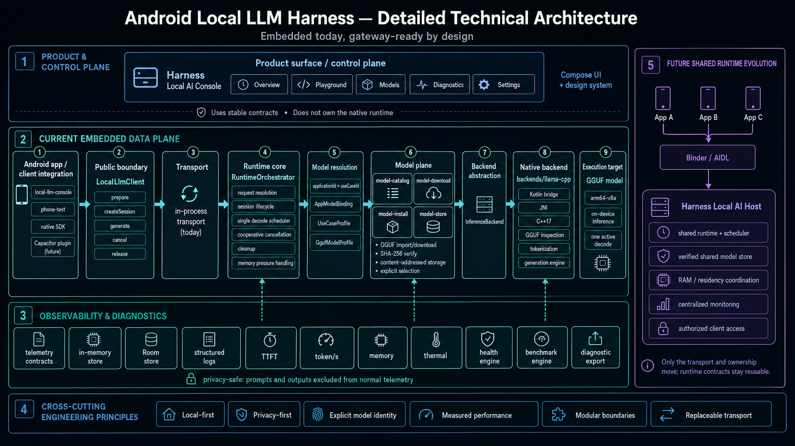

# Architecture

Status: active
Document type: architecture
Owner: repository
Canonical scope: architecture.repository
Read when: changing module boundaries, dependency direction, deployment shape or ownership
Last reviewed: 2026-08-08



## Data plane

```text
Native app / Capacitor plugin
            |
       LocalLlmClient
            |
     InProcessTransport
            |
    RuntimeOrchestrator
      |       |       |
 App registry |   TelemetryRepository
      |       |      /              \
 Model profile|  in-memory       Room store
      |       |
      |    Model store
      |       |
      +--- llama.cpp JNI ---> GGUF
```

The embedded runtime and the future shared service must execute the same data plane. Only the transport and model-store ownership change.

Runtime orchestration depends only on `observability/contracts`. Android Room remains isolated in `observability/room-store`; deterministic tests and ephemeral integrations may use `observability/in-memory-store` instead.

## Product support envelope

The product exposes only repository-reviewed Qwen3.5 dense 0.8B and 2B artifacts under [ADR 0011](adr/0011-qwen35-only-product-support.md). Public lifecycle, binding, telemetry and backend contracts remain model-family neutral; this is an architectural boundary, not a generic model-support promise.

Users do not extend the product with arbitrary GGUF files. Verified download/install from the curated catalog is the only consumer model acquisition path. Generic manual-import, legacy-model and multi-family product cases are removed rather than represented through compatibility states. The focused ownership map lives in [`qwen35/architecture.md`](qwen35/architecture.md), and Q35-1 cleanup is owned by [`qwen35/workstreams/curated-model-baseline.md`](qwen35/workstreams/curated-model-baseline.md).

## Persistent observability

Generation observability follows the same request identifiers and lifecycle as the data plane:

```text
GenerationRequest
      |
      +-- QUEUED
      +-- RUNNING
      +-- COMPLETED / FAILED / CANCELLED
                    |
             TelemetryRepository
               /          \
      bounded memory     Room database
```

The persistent schema owns three separate domains:

1. generation run records, keyed by request ID;
2. append-only structured logs with request correlation;
3. latest health result per health-check ID.

Run updates replace the record for the same request ID, while logs remain ordered timeline events. Retention is bounded independently for runs and logs. Room operations execute on a dedicated single-thread executor so the current synchronous inspection API never requires main-thread database access.

Normal telemetry may contain:

- stable application, use-case, request and model identifiers;
- lifecycle status and error codes;
- timestamps and durations;
- queue, model-load, TTFT, prefill and decode timings;
- token counts and decode throughput;
- bounded structured metadata fields.

Normal telemetry must not contain prompts, generated output, arbitrary exception messages or model bytes. Telemetry persistence is best-effort: a database or diagnostic failure must never fail, cancel or corrupt inference.

## Control plane

The `local-llm-console` application is the initial developer control plane. It will expose:

- runtime overview;
- application/use-case bindings;
- installed GGUF artifacts;
- model/context lifecycle;
- per-run timelines;
- structured logs;
- latency, throughput and memory metrics;
- cache inspection and invalidation;
- sanity and health suites;
- benchmark history;
- privacy-safe diagnostic export.

During the embedded phase, apps will expose a signature-protected diagnostics bridge. In the shared phase, the console will query the central host directly.

A Room database stored in one embedded application's private directory is not directly readable by the separate console application. The Room repository establishes persistence and query semantics now; cross-application viewing remains dependent on the protected diagnostics bridge planned for the integration phase.

## Validation plane

The `apps/device-test-runner` application is an isolated, debuggable validation surface for the embedded data plane. It does not own product behavior and must not introduce an alternative runtime implementation.

Its instrumentation tests use the production implementations of:

```text
FileSystemModelStore
        |
RuntimeOrchestrator
        |
LlamaCppInferenceBackend
        |
JNI / llama.cpp
```

A host-side `adb` runner may stream an exact developer-selected validation GGUF into the test application's private data directory. This is test infrastructure only; it does not create a consumer model-import path. The model remains outside the repository and APK artifacts.

The validation plane covers behavior that cannot be established by JVM or host-native tests alone:

- Android ABI and JNI packaging;
- GGUF inspection on device;
- app-private test artifact installation and integrity verification;
- native model and context lifecycle;
- streaming generation and metrics;
- cooperative active cancellation;
- repeated lifecycle and process-memory regression checks.

Test configuration may describe a specific curated model and device, but it must preserve the same explicit binding path used by applications. Device tests may measure production code; they must not duplicate or bypass model resolution, store integrity or runtime ownership rules.

## Model identity

A model is represented at three levels:

1. `GgufArtifact`: immutable physical file identified by SHA-256.
2. `GgufModelProfile`: exact load configuration for that artifact.
3. `UseCaseProfile`: prompt, generation, output and cache policy for a product use case.

`AppModelBinding` resolves `applicationId + useCaseId` to a single explicit use-case profile.

Multiple profiles may target different curated Qwen3.5 0.8B/2B artifacts or quantizations. Model-aware identity and scheduling do not make the catalog extensible to other families or tiers.

## Cache hierarchy

Caches are separate domains because they have different invalidation rules:

1. GGUF artifact store on disk.
2. Operating-system file page cache through memory mapping.
3. Loaded model handle in RAM.
4. Context/KV cache per session.
5. Prefix/session snapshots keyed by model, backend build and prompt profile.
6. Optional deterministic result cache, namespaced by application and use case.

The initial implementation only defines artifact and in-memory lifecycle contracts. Snapshot/result caching will be added after correctness and benchmark baselines are established.

## Runtime invariants

- One loaded model and one active decode by default.
- No undeclared model substitution.
- Every generation has stable application, use-case, session and request identifiers.
- Prompt/output persistence is disabled by default.
- Telemetry failures are non-fatal to inference.
- Native handles are never exposed outside the backend module.
- Large payloads will not cross the future Binder boundary inline.
- State mutations and backend-handle ownership changes are serialized by the runtime orchestrator.
- Cancellation and partial failures must leave the runtime recoverable.

## Modularity and maintainability

The codebase must remain modular, extensible and independently testable without becoming fragmented into speculative modules.

Dependencies follow this direction:

```text
apps / integrations
        |
     transports
        |
 core contracts + runtime orchestration
        |
 model profiles + model store + observability contracts
        |
 backend interfaces
        |
 llama.cpp Kotlin bridge / JNI / C++ implementation
```

Higher layers may depend on lower-level contracts. Lower layers must not import application UI, Capacitor adapters or other product-specific integrations.

The main ownership boundaries are:

```text
core/contracts
    public contracts and backend-independent DTOs

core/runtime-core
    orchestration, sessions, scheduling, lifecycle and telemetry emission

models/model-profile
    model, use-case and application binding configuration

models/model-store
    artifact storage, identity and integrity

backends/llama-cpp
    Kotlin/JNI/C++ implementation specific to llama.cpp

observability/contracts
    stable telemetry, log, health, retention and query contracts

observability/in-memory-store
    bounded ephemeral implementation and deterministic test double

observability/room-store
    Android Room schema, persistence, retention and database lifecycle

transports
    in-process communication now and Binder later

integrations
    thin native Android and Capacitor adapters

apps
    developer console, sample applications and isolated device validation surfaces
```

A new module is justified only when it owns a real responsibility, creates a necessary dependency boundary, provides actual reuse, isolates a platform or third-party dependency, or needs an independent testing/release boundary.

Do not introduce empty modules merely to anticipate the target architecture. Do not solve duplication by moving unrelated code into generic utility packages. Shared abstractions must represent a clear domain concept.

Public APIs must remain small and stable. Backend, transport, model store, scheduler, telemetry store and cache policies should be replaceable behind explicit interfaces when replacement is part of the architecture.

## Shared generation engine

Synchronous generation and streaming must share the same underlying generation behavior:

- prompt and chat-template preparation;
- tokenization;
- context-limit validation;
- sampler construction;
- prefill;
- decode;
- token-to-text conversion;
- stop-condition handling;
- metric collection;
- typed error mapping;
- temporary resource ownership and cleanup.

They differ only in how output is delivered and how cancellation is surfaced to the caller.

The JNI boundary must remain coarse-grained. Avoid crossing JNI once per token when output can be aggregated safely.

Native code should be split by responsibility and linked through CMake. The target decomposition is conceptually:

```text
backend_runtime
model_registry
context_registry
gguf_inspector
tokenizer
sampler_factory
generation_engine
streaming_sink
cancellation_registry
jni_converters
jni_entrypoints
```

This is an ownership map, not a requirement to create empty files. Components should be extracted when the corresponding responsibility has concrete behavior and tests.

Do not include implementation `.cpp` files from other `.cpp` files to share logic.

## Architectural change policy

A change that alters module ownership, dependency direction, public contracts, native resource ownership, model identity, transport boundaries or privacy defaults requires:

1. updated architecture documentation;
2. an ADR when the decision materially constrains future implementations;
3. updated tests and validation evidence;
4. updated coding-agent navigation when paths or ownership change.

The repository-wide completion rules are defined in [`definition-of-done.md`](definition-of-done.md).
