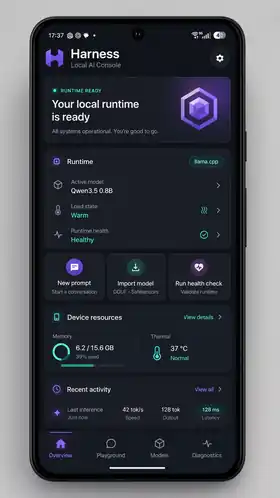
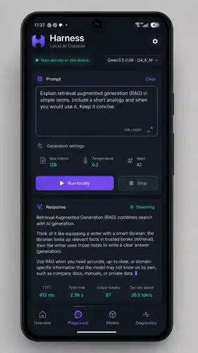
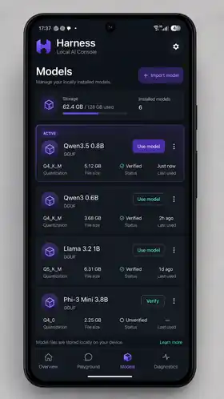
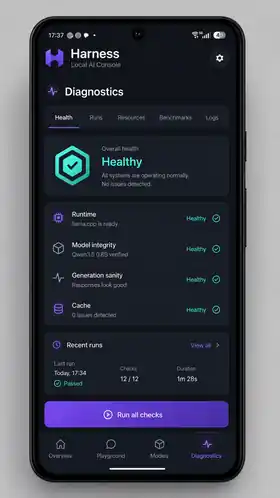
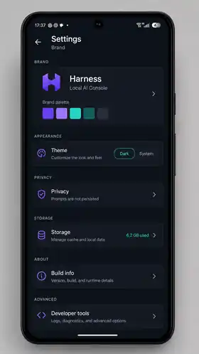

# Harness Android UX/UI implementation plan

**Status:** Proposed implementation plan  
**Target repository:** `daniele21/android-local-llm-harness`  
**Primary target application:** `apps/local-llm-phone-test`, branded in-product as **Harness — Local AI Console**  
**Supporting source application:** `apps/local-llm-console`  
**Last updated:** 2026-08-04

## 1. Purpose

This document turns the approved Harness mockups into an implementation plan for the Android local-LLM harness.

The goal is not to restyle the current single scrolling test screen. The goal is to create a coherent product shell that makes local inference, model management, runtime state, diagnostics, and physical-device validation understandable and usable on Android while preserving the existing runtime, privacy, and lifecycle guarantees.

The implementation must:

- keep inference and GGUF data on-device;
- preserve the existing `RuntimeOrchestrator`, `LlamaCppInferenceBackend`, `FileSystemModelStore`, cancellation, session cleanup, and model-integrity behavior;
- avoid introducing Binder/AIDL or a shared cross-application runtime in this UX/UI phase;
- make the Play-installable app the first fully connected Harness experience;
- reuse the existing console presenters and diagnostic contracts instead of duplicating runtime or observability logic;
- remain usable on compact phones, larger phones, tablets, portrait, and landscape;
- support accessibility, dynamic text, TalkBack, and low-motion operation;
- keep prompts and generated output out of normal telemetry and persistence.

## 2. Mockup gallery

The following images are directional product mockups. They define information hierarchy, visual language, and intended navigation. They are not pixel-perfect implementation specifications and some illustrative values must be replaced by real runtime data.

<table>
<tr>
<td align="center"><strong>Overview</strong><br></td>
<td align="center"><strong>Playground</strong><br></td>
</tr>
<tr>
<td align="center"><strong>Models</strong><br></td>
<td align="center"><strong>Diagnostics</strong><br></td>
</tr>
<tr>
<td align="center" colspan="2"><strong>Settings and brand</strong><br></td>
</tr>
</table>

### Mockup interpretation rules

- `Harness` is the product brand; `Local AI Console` is the descriptor.
- The implementation supports **GGUF only** in this phase. Any mockup reference to Safetensors is illustrative and must not be implemented or displayed.
- Model names, file sizes, memory values, temperatures, throughput, and latency in the mockups are examples. The application must show actual values or an explicit unavailable state.
- The generated logo is a direction, not a production-ready trademark or final vector asset.
- The UI must never imply that a runtime, model, health check, benchmark, or metric is available when the underlying source is disconnected or has not run.

## 3. Current implementation constraints

### 3.1 Play-installable app

`apps/local-llm-phone-test` is currently the only normal launcher application that is connected to:

- Android Storage Access Framework model selection;
- private staging and SHA-256 calculation;
- the content-addressed `FileSystemModelStore`;
- `RuntimeOrchestrator`;
- `LlamaCppInferenceBackend`;
- manual prompt generation and streaming;
- cancellation;
- session cleanup;
- physical-device validation;
- privacy-safe validation reports.

Its UI is built programmatically in one `Activity` with `ScrollView`, `LinearLayout`, `TextView`, `EditText`, and `Button`. The controllers use callback listeners and single-thread executors. This is appropriate for an evidence app but not for the target product structure.

The current model metadata persistence is effectively a **single selected/imported model**. The content-addressed store can contain artifacts, but the app does not yet maintain a durable multi-model catalog with display name, architecture, quantization, last-used time, and selection state.

### 3.2 Standalone console

`apps/local-llm-console` already contains presenter and control-plane work for:

- overview;
- model inventory;
- runtime snapshot;
- generation runs;
- request timelines;
- logs;
- health;
- cache status and repair;
- resource charts;
- benchmarks;
- manual inference controls.

However, the standalone console currently uses a private sandbox/in-memory composition and is intentionally disconnected from the real embedded runtime, runtime-owned cache, and application/use-case registry.

Its UI is also built using programmatic Android Views in one `Activity`.

### 3.3 Build and UI stack

The repository currently does not declare Jetpack Compose, Material 3, Navigation Compose, lifecycle-compose, coroutines, or a shared UI module in the version catalog.

The implementation therefore requires an explicit UI-platform foundation before screen migration.

## 4. Product and architecture decision

### 4.1 First connected product surface

The first production-like Harness UI will be implemented in:

```text
apps/local-llm-phone-test
```

The module name will remain unchanged during the first redesign to avoid unnecessary risk to:

- package and Play Console continuity;
- signing scripts;
- packaging workflows;
- release documentation;
- physical-device evidence paths.

The user-facing application label, launcher presentation, in-app title, and brand will change to:

```text
Harness
Local AI Console
```

The stable application ID remains:

```text
io.github.daniele21.localllm.phonetest
```

A later ADR may rename the Gradle module and Kotlin package after the new UI has been validated. That rename is not a prerequisite for this plan.

### 4.2 Relationship with `local-llm-console`

The redesign must not copy and fork console behavior into the Play app.

Instead:

1. preserve existing UI-independent contracts, presenters, controls, and data-source boundaries;
2. extract reusable console presentation code from the standalone app package when necessary;
3. inject real, in-process capabilities from the Play app composition root;
4. keep the standalone console as a sandbox/developer shell until a protected cross-application bridge exists;
5. do not introduce Binder/AIDL as part of the visual redesign.

### 4.3 Runtime ownership

The final connected app should have one application-scoped composition root, provisionally named:

```text
HarnessRuntimeGraph
```

It will own or provide:

- the app-private `FileSystemModelStore`;
- the installed-model metadata catalog;
- the current model selection;
- the `LlamaCppInferenceBackend`;
- the embedded `RuntimeOrchestrator` / `LocalLlmClient` boundary;
- telemetry repository;
- health engine and registered checks;
- resource probe;
- benchmark services;
- runtime-owned cache probes and maintenance controls;
- physical-device validation coordinator.

This removes the current duplication where playground and validation independently construct runtime objects while still preserving explicit session and request lifecycles.

The graph must remain lazy. Importing a model or opening a screen must not load the model. Model loading occurs only when an operation explicitly requires it.

## 5. Scope

### 5.1 Included

- Harness brand shell and launcher identity;
- dark-first Material 3 design system with light/system support;
- compact bottom navigation and expanded navigation rail;
- Overview screen;
- connected Playground screen;
- Models screen and GGUF import flow;
- Diagnostics container with Health, Runs, Resources, Benchmarks, and Logs;
- Settings screen;
- physical-device validation moved into Developer tools / Diagnostics;
- responsive layouts;
- accessibility and semantic content descriptions;
- UI state, events, reducers, ViewModels, and adapters;
- Compose unit/UI tests and selected screenshot tests;
- documentation and mockup traceability.

### 5.2 Explicitly excluded

- multi-turn chat history persistence;
- prompt or output persistence;
- cloud inference;
- internet model download;
- Safetensors support;
- arbitrary runtime profiles created by end users;
- editing system prompts;
- Binder/AIDL shared runtime;
- cross-application diagnostics bridge;
- automatic background health polling;
- automatic resource sampling timers;
- remote analytics;
- production trademark clearance or final professional logo artwork;
- iOS or desktop UI.

## 6. Information architecture

### 6.1 Primary destinations

| Destination | Compact phone | Expanded/tablet | Purpose |
| --- | --- | --- | --- |
| Overview | bottom navigation | navigation rail | current model/runtime/device summary and quick actions |
| Playground | bottom navigation | navigation rail | one-shot local inference and streaming |
| Models | bottom navigation | navigation rail | imported GGUF inventory and actions |
| Diagnostics | bottom navigation | navigation rail | health, runs, resources, benchmarks, logs |
| Settings | top-app-bar gear | rail footer or top-app-bar gear | appearance, privacy, storage, build and developer tools |

### 6.2 Route model

```kotlin
enum class HarnessDestination {
    OVERVIEW,
    PLAYGROUND,
    MODELS,
    DIAGNOSTICS,
    SETTINGS,
}

enum class DiagnosticsSection {
    HEALTH,
    RUNS,
    RESOURCES,
    BENCHMARKS,
    LOGS,
}
```

Detail routes:

```text
models/{digest}
runs/{requestId}
settings/privacy
settings/storage
settings/build
settings/developer-tools
settings/developer-tools/physical-validation
```

Sensitive identifiers are passed as navigation arguments only when needed and are not written to logs.

### 6.3 Back behavior

- Back from a detail screen returns to its parent destination.
- Back from Settings returns to the previously selected main destination.
- Back from a top-level destination exits the app only after Navigation Compose has no internal back-stack entry.
- An active generation is not cancelled by navigation alone.
- Leaving Playground while generation is active shows a persistent generation indicator in the app shell; returning restores the in-memory state.
- Exiting the app follows the existing lifecycle policy. It must not silently persist prompt or output content.

## 7. Brand kit

## 7.1 Brand foundation

**Name:** Harness  
**Descriptor:** Local AI Console  
**Core promise:** local execution with visible control and measurable behavior  
**Tagline candidate:** Run local. Measure everything.

Brand attributes:

- controlled;
- private;
- technical;
- measurable;
- reliable;
- modern without looking experimental or “hacker themed”.

### 7.2 Logo direction

The mockup uses a geometric `H` built from two mirrored blocks. The intended symbolism is:

- outer blocks: the harness around a runtime;
- central bridge: controlled token flow;
- symmetrical shape: predictable lifecycle and instrumentation.

Implementation sequence:

1. use a temporary repository-owned vector placeholder derived from simple geometric paths;
2. create adaptive launcher foreground/background resources;
3. validate legibility at 16, 24, 32, 48, and 108 px;
4. commission or finalize a production SVG before public distribution;
5. retain monochrome and single-color variants for Android themed icons.

Do not use a brain, robot, sparkles-only mark, or vendor/model-specific symbol as the primary logo.

### 7.3 Color tokens

Dark theme target tokens:

| Token | Value | Use |
| --- | --- | --- |
| `brandBackground` | `#0B0F14` | primary app background |
| `brandSurface` | `#121821` | cards and lower surfaces |
| `brandSurfaceElevated` | `#19212C` | sheets, menus, dialogs |
| `brandPrimary` | `#7C5CFC` | primary actions and selection |
| `brandPrimaryContainer` | `#2A2057` | selected navigation/card accents |
| `brandSecondary` | `#25C2A0` | local, active, private, connected |
| `brandSecondaryContainer` | `#103D36` | local/privacy badges |
| `brandTextPrimary` | `#F5F7FA` | primary text |
| `brandTextSecondary` | `#98A2B3` | labels and metadata |
| `brandOutline` | `#2B3543` | card and input borders |
| `brandSuccess` | `#38C172` | healthy/completed |
| `brandWarning` | `#F4B740` | warnings/thermal pressure |
| `brandError` | `#EF5B5B` | failures/destructive actions |

A light theme must be derived as a complete semantic theme, not by inverting colors mechanically. The default first-run behavior should follow system theme; the internal-test release may default to dark only if explicitly documented and tested.

### 7.4 Typography

Initial offline implementation:

- UI: Android system sans-serif;
- technical identifiers and logs: Android system monospace.

Target brand typography after license review:

- UI: Inter;
- technical data: JetBrains Mono.

No downloadable font dependency should be required at runtime. No font binary is added until licensing, bundle size, and offline behavior have been reviewed.

Type scale:

| Role | Size | Weight |
| --- | --- | --- |
| display / hero | 32 sp | 700 |
| page title | 28 sp | 700 |
| section title | 20 sp | 600 |
| card title | 16 sp | 600 |
| body | 15–16 sp | 400 |
| label | 13–14 sp | 500 |
| metadata | 12–13 sp | 400 |
| metric value | 18–22 sp | 600 |

All text must respect user font scaling. Fixed-height containers that clip scaled text are forbidden.

### 7.5 Shape and spacing

```text
spacing: 4 / 8 / 12 / 16 / 20 / 24 / 32 / 40 dp
screen horizontal padding: 16 dp compact, 24 dp medium, 32 dp expanded
card radius: 16 dp
button radius: 12 dp
input radius: 12 dp
bottom-sheet top radius: 24 dp
minimum touch target: 48 x 48 dp
```

### 7.6 Iconography

Use Material Symbols / Material Icons through a pinned Android dependency or repository-owned vectors for the small required set.

Primary mapping:

| Concept | Icon direction |
| --- | --- |
| Overview | home / dashboard |
| Playground | chat / terminal |
| Models | deployed code / cube |
| Diagnostics | monitoring / pulse |
| Runtime | memory / developer board |
| Privacy | lock / shield |
| Health | health and safety / verified |
| Import | file download / add box |
| Logs | receipt long / list |
| Settings | settings |

Color must not be the only status indicator. Every semantic state includes text and/or an icon.

### 7.7 Motion

Allowed:

- 150–250 ms destination transitions;
- subtle state fades;
- determinate progress transitions;
- streaming cursor or waveform with reduced-motion fallback;
- card expansion/collapse.

Not allowed:

- continuous decorative animation;
- parallax;
- particle effects;
- animation that hides runtime latency;
- animation that continues while the app is backgrounded.

Respect the platform animation scale and reduced-motion preference where available.

## 8. Design-system module

Create a shared Android library:

```text
ui/design-system
```

Suggested package:

```text
io.github.daniele21.localllm.ui.designsystem
```

Suggested structure:

```text
ui/design-system/
  build.gradle.kts
  src/main/kotlin/.../theme/
    HarnessColor.kt
    HarnessTheme.kt
    HarnessTypography.kt
    HarnessShape.kt
    HarnessSpacing.kt
  src/main/kotlin/.../components/
    HarnessAppBar.kt
    HarnessNavigation.kt
    HarnessCard.kt
    HarnessButton.kt
    HarnessStatusBadge.kt
    HarnessMetric.kt
    HarnessEmptyState.kt
    HarnessErrorState.kt
    HarnessLoadingState.kt
    HarnessSectionHeader.kt
    HarnessCodeBlock.kt
    HarnessChartContainer.kt
    HarnessConfirmationDialog.kt
  src/main/res/drawable/
  src/test/
  src/androidTest/
```

Core components:

| Component | Responsibility |
| --- | --- |
| `HarnessAppBar` | brand, screen title, settings, contextual actions |
| `HarnessNavigationBar` | compact four-destination navigation |
| `HarnessNavigationRail` | medium/expanded navigation |
| `HarnessCard` | consistent elevation, outline, padding, semantics |
| `HarnessStatusBadge` | connected, local, healthy, warm, warning, failed |
| `HarnessPrimaryButton` | high-emphasis action |
| `HarnessSecondaryButton` | neutral/outlined action |
| `HarnessDestructiveButton` | removal and destructive confirmation |
| `HarnessMetricGrid` | responsive metrics without monospaced paragraphs |
| `HarnessEmptyState` | actionable empty source state |
| `HarnessSourceError` | privacy-safe source failure |
| `HarnessCodeBlock` | logs, hashes, validation report, selectable text |
| `HarnessChartContainer` | chart title, legend, unavailable state, content description |

Component APIs must accept semantic state and content. They must not query runtime or repositories directly.

## 9. Compose platform foundation

Add pinned version-catalog entries for a mutually compatible set of:

- Compose BOM;
- `androidx.activity:activity-compose`;
- Compose UI;
- Compose Foundation;
- Compose Material 3;
- UI tooling preview and debug tooling;
- Navigation Compose;
- lifecycle runtime Compose;
- lifecycle ViewModel Compose;
- Kotlin coroutines Android;
- Compose UI test JUnit4 and test manifest;
- optional adaptive navigation/window-size artifacts after compatibility review.

Required application configuration:

```kotlin
android {
    buildFeatures {
        compose = true
    }
}
```

The exact versions must be pinned in `gradle/libs.versions.toml` and validated with AGP 9.3, compile SDK 36, target SDK 36, min SDK 26, and the repository's built-in Kotlin configuration.

No dynamic dependency version is permitted.

## 10. Application UI architecture

### 10.1 Package structure

Within `apps/local-llm-phone-test`:

```text
ui/
  HarnessApp.kt
  HarnessAppState.kt
  navigation/
    HarnessDestination.kt
    HarnessNavHost.kt
    HarnessAdaptiveNavigation.kt
  overview/
    OverviewRoute.kt
    OverviewScreen.kt
    OverviewViewModel.kt
    OverviewUiState.kt
  playground/
    PlaygroundRoute.kt
    PlaygroundScreen.kt
    PlaygroundViewModel.kt
    PlaygroundUiState.kt
    GenerationSettingsSheet.kt
  models/
    ModelsRoute.kt
    ModelsScreen.kt
    ModelsViewModel.kt
    ModelsUiState.kt
    ModelDetailScreen.kt
    ModelImportFlow.kt
  diagnostics/
    DiagnosticsRoute.kt
    DiagnosticsScreen.kt
    DiagnosticsViewModel.kt
    HealthScreen.kt
    RunsScreen.kt
    RunDetailScreen.kt
    ResourcesScreen.kt
    BenchmarksScreen.kt
    LogsScreen.kt
  settings/
    SettingsRoute.kt
    SettingsScreen.kt
    PrivacyScreen.kt
    StorageScreen.kt
    BuildInfoScreen.kt
    DeveloperToolsScreen.kt
    PhysicalValidationScreen.kt
runtime/
  HarnessRuntimeGraph.kt
  HarnessRuntimeController.kt
  HarnessRuntimeState.kt
models/
  InstalledModelCatalog.kt
  InstalledModelMetadata.kt
  SelectedModelRepository.kt
validation/
  PhysicalValidationCoordinator.kt
```

### 10.2 State pattern

Use unidirectional data flow.

Each screen exposes:

```kotlin
data class ScreenUiState(...)

sealed interface ScreenAction

class ScreenViewModel(...) : ViewModel {
    val uiState: StateFlow<ScreenUiState>
    fun onAction(action: ScreenAction)
}
```

Rules:

- Composables render immutable UI state.
- Composables do not call `RuntimeOrchestrator`, `ModelStore`, Room, or executors directly.
- One-off user messages use an event/effect channel or explicit consumed state.
- Prompt and generated output remain only in the Playground ViewModel/process memory.
- Saved state may retain non-sensitive navigation and UI preferences, but not prompt or generated output.
- All source errors exposed to UI are fixed, privacy-safe messages.

### 10.3 Existing-controller migration

Migration must be incremental:

1. wrap the current callback controllers in ViewModels so the existing behavior can power Compose;
2. write state-mapping tests;
3. move shared runtime ownership into `HarnessRuntimeGraph`;
4. reduce the legacy controllers to adapters or replace them only after parity tests pass;
5. delete the programmatic View UI after the Compose path is validated on-device.

Do not combine the UI rewrite with a simultaneous complete runtime rewrite.

## 11. Screen specifications

## 11.1 Overview

### Purpose

Answer within five seconds:

1. Is local inference available?
2. Which model is selected or loaded?
3. Is the runtime cold, warm, busy, or unavailable?
4. Is the device under memory or thermal pressure?
5. What is the next useful action?

### Content order

1. brand app bar;
2. runtime readiness hero/status card;
3. runtime summary card;
4. quick actions;
5. device resources summary;
6. recent activity;
7. bottom navigation.

### Overview state

```kotlin
data class OverviewUiState(
    val runtime: RuntimeSummaryUi,
    val selectedModel: ModelSummaryUi?,
    val resources: ResourceSummaryUi,
    val recentRun: RecentRunUi?,
    val activeOperation: ActiveOperationUi?,
    val sourceError: String? = null,
)
```

Required states:

- no model imported;
- model imported, runtime unloaded/cold;
- runtime loading;
- runtime ready/warm;
- generation active;
- validation active;
- low-memory warning;
- thermal warning;
- unavailable resource metric;
- source failure.

Quick actions:

- `New prompt` navigates to Playground;
- `Import model` starts the import flow;
- `Run health check` navigates to Diagnostics/Health and requires explicit start.

No implicit runtime load occurs when Overview opens.

### Acceptance criteria

- no fabricated metrics;
- every status has text, icon, and semantic description;
- resource cards render `Unavailable` rather than `0` when a probe is unavailable;
- opening Overview performs no model load, generation, verification, or health execution;
- quick actions remain disabled only when their real capability is unavailable or conflicting work is active.

## 11.2 Playground

### Purpose

Provide the primary one-shot local-inference experience with explicit model selection, bounded generation settings, streaming output, cancellation, and readable metrics.

### Content order

1. app bar and local-only badge;
2. selected model control;
3. prompt composer;
4. collapsed generation-settings row;
5. primary run/stop action;
6. phase/status indicator;
7. response card;
8. metrics;
9. bottom navigation.

### Prompt behavior

- maximum: 32,768 characters, matching current controller behavior;
- show character count near the limit;
- no automatic persistence;
- no clipboard read without a user paste action;
- `Clear` requires confirmation only while generation is active or output exists;
- changing selected model while generation is active is blocked;
- changing selected model while idle releases the previous runtime before preparing a new model.

### Generation settings

Default collapsed presentation:

```text
Generation settings · 128 tokens · temperature 0.2 · seed 42
```

Bottom sheet fields:

- maximum output tokens;
- temperature;
- seed;
- reset to defaults.

Validation must reuse the existing `PlaygroundRequestOptions` bounds and not introduce a second set of limits in UI code.

### Playground phases

| Runtime phase | UI label | Primary action |
| --- | --- | --- |
| idle | Ready | Run locally |
| verifying | Verifying model | disabled |
| preparing | Preparing runtime | Stop only if cancellation is supported |
| queued | Queued | Cancel |
| generating | Generating locally | Stop generation |
| completed | Completed | Run again |
| cancelled | Cancelled | Run again |
| failed | Generation failed | Retry |
| cleanup failed | Cleanup failed | Release runtime / Retry after recovery |

### Output and metrics

Output remains bounded to 131,072 characters. If truncated, show an explicit banner and preserve the terminal state.

Metrics are displayed as individual values:

- model load kind;
- model load duration when cold;
- queue time;
- TTFT;
- total duration;
- input tokens;
- output tokens;
- decode throughput.

Unavailable metrics use `—` / `Unavailable` and are not coerced to zero.

### Acceptance criteria

- streaming deltas update without resetting scroll position unexpectedly;
- the user can manually follow the stream or keep reading earlier text;
- auto-scroll occurs only when already near the bottom;
- cancellation remains cooperative and race-safe;
- session cleanup occurs for complete, failed, and cancelled terminal states;
- navigation does not persist prompt/output;
- screen rotation does not write prompt/output to saved instance state;
- process death clears sensitive in-memory content;
- a second request cannot start while one owns the session;
- runtime warm reuse remains observable between compatible prompts.

## 11.3 Models

### Purpose

Make GGUF import, verification, selection, details, and removal understandable without exposing private filesystem paths.

### Phase 1 behavior: one selected model

The first Models screen may show one imported model because that matches current durable app metadata.

Actions:

- import/replace GGUF;
- use in Playground;
- verify integrity;
- view details;
- remove with confirmation.

### Phase 2 behavior: multi-model catalog

Implement `InstalledModelCatalog` to persist non-sensitive metadata:

```kotlin
data class InstalledModelMetadata(
    val digest: ModelDigest,
    val displayName: String,
    val sizeBytes: Long,
    val architecture: String,
    val quantization: String,
    val importedAtEpochMs: Long,
    val lastUsedAtEpochMs: Long?,
)
```

The catalog stores no source URI and no private backing path.

The `FileSystemModelStore` remains authoritative for artifact existence and verification. The catalog is presentation/profile metadata only.

Catalog reconciliation rules:

- catalog entry without store artifact: show unavailable/orphaned and offer metadata removal;
- store artifact without catalog entry: show recoverable unknown model or request metadata association;
- duplicate digest: one artifact, one catalog identity, no duplicate storage;
- selected model removal: block while runtime owns it, otherwise release runtime then confirm removal;
- failed verification: keep the model visible with failed status and prevent use until re-import or successful verification.

### Import flow

1. user taps Import model;
2. Storage Access Framework picker opens;
3. selected document must end with `.gguf`;
4. app displays file name and provider-reported size if available;
5. app requests architecture and quantization only when they cannot be reliably derived;
6. app stages privately while hashing;
7. app imports into content-addressed storage;
8. app verifies the stored artifact;
9. app writes catalog metadata only after successful import;
10. app offers `Use now` or `Done`.

The UI never claims metadata was read from GGUF when it was supplied manually.

### Model card fields

- display name;
- architecture;
- quantization;
- size;
- integrity status;
- active/selected state;
- last used;
- overflow actions.

### Acceptance criteria

- only GGUF is advertised;
- no private path or URI is displayed or logged;
- import, verification, and removal run off the main thread;
- replacing/removing an active model releases runtime explicitly;
- removal requires confirmation and identifies the model by safe display name/digest prefix;
- large model names wrap or ellipsize without covering actions;
- empty state has one clear Import model action.

## 11.4 Diagnostics

### Container

Diagnostics uses a top-level destination and a horizontally scrollable secondary tab row:

```text
Health | Runs | Resources | Benchmarks | Logs
```

The selected section is retained in the app process and restored as a non-sensitive navigation state.

### Health

Content:

- overall worst status;
- source/capability state;
- check list;
- last run summary;
- `Run all checks`;
- targeted check actions;
- physical-device validation entry.

Required statuses:

```text
NOT_RUN / PASS / WARN / FAIL / UNAVAILABLE / RUNNING
```

Do not render `Healthy` until checks have actually produced a PASS result.

### Runs

List fields:

- terminal/current status;
- application/use case;
- model digest prefix or safe model display name;
- cold/warm classification;
- TTFT;
- total duration;
- throughput;
- timestamp.

Run details show a chronological event timeline and privacy-safe structured logs. Prompt/output are absent.

### Resources

Charts:

- process PSS;
- native heap;
- Java heap;
- available device memory;
- Android thermal status;
- low-memory signals.

Chart rules:

- no invented zero values;
- gaps for unavailable measurements;
- accessible text summary for every chart;
- no hidden polling timer;
- refresh/capture is explicit unless an active operation already captures a documented point;
- thermal levels use text labels in addition to color.

### Benchmarks

Initial screen:

- active benchmark key;
- readiness/sample count;
- median TTFT;
- p95 total latency;
- median decode throughput;
- baseline comparison state;
- clear `No baseline` and `Insufficient samples` states.

Benchmark history depends on the benchmark-history implementation being rebased/merged onto current `main` or recreated on a fresh branch. The UX work must not depend directly on the historical stacked branch.

### Logs

Controls:

- severity filter;
- request filter;
- search over privacy-safe message and structured field names/values;
- copy selected entry;
- clear UI filters;
- export only after the privacy-redacted diagnostic bundle capability exists.

No raw backend exception, prompt, output, private path, document URI, or model bytes are shown.

### Acceptance criteria

- each sub-screen has disconnected, empty, loading, populated, and source-error states;
- actions are capability-driven;
- no health/repair/benchmark operation starts during simple navigation or refresh;
- long log values are selectable and wrap safely;
- run timeline ordering is deterministic;
- destructive cache repair is distinct from observational cache health.

## 11.5 Settings

### Sections

**Appearance**

- System / Dark / Light;
- optional dynamic color toggle only after brand-consistency review;
- reduced motion preference if platform detection is insufficient.

**Privacy**

- prompts are not persisted;
- generated output is not persisted;
- normal telemetry excludes content;
- GGUF remains in app-private storage;
- no internet permission / network use, if still true for the build;
- clear in-memory Playground action.

**Storage**

- model artifacts total;
- telemetry/database total when measurable;
- cache status;
- model management shortcut;
- explicit destructive cleanup with confirmation.

**Build info**

- app version name/code;
- commit SHA when injected at build time;
- Android version;
- ABI;
- backend/llama.cpp revision;
- privacy-safe copy action.

**Developer tools**

- physical-device validation;
- detailed logs;
- health checks;
- resource capture;
- diagnostic export when implemented;
- advanced runtime information.

### Physical-device validation screen

Move the current full-validation experience here or link it from Diagnostics/Health.

Content:

- what will run;
- estimated duration range as informational, not guaranteed;
- selected model;
- cancellation limitations;
- keep-screen-on explanation;
- progress steps;
- privacy-safe final report;
- copy/share actions.

The feature remains available but no longer dominates the primary application experience.

## 12. Responsive layout

### 12.1 Window classes

Use measured available width rather than device type.

| Width | Navigation | Content behavior |
| --- | --- | --- |
| compact `< 600 dp` | bottom navigation | one column |
| medium `600–839 dp` | navigation rail | one or two columns depending on screen |
| expanded `>= 840 dp` | navigation rail + optional detail pane | master/detail where useful |

### 12.2 Screen adaptations

- Overview: quick actions become a row/grid on medium widths.
- Playground: composer and response may become two panes on expanded landscape only; compact stays vertical.
- Models: list + detail pane on expanded.
- Diagnostics: section rail/tab plus content; Runs may use list/detail split.
- Settings: max content width around 720 dp, centered.

### 12.3 Insets and system UI

- edge-to-edge layout;
- consume status/navigation bar insets correctly;
- respect display cutouts;
- do not place primary actions behind gesture navigation;
- IME-safe prompt composer and bottom sheet;
- keep the run/stop action visible when the keyboard opens without covering prompt text.

## 13. Accessibility

Mandatory requirements:

- 48 dp minimum touch targets;
- TalkBack labels for all icons and status badges;
- navigation items expose selected state;
- charts expose text summaries;
- errors are announced through live regions or equivalent semantics;
- streaming content does not announce every token; announce phase changes and completion instead;
- contrast target at least 4.5:1 for normal text and 3:1 for large text/UI boundaries;
- color is not the sole status signal;
- dynamic font scaling tested to at least 200%;
- landscape and switch-access traversal order validated;
- destructive confirmations name the target and action;
- no flashing or rapidly pulsing animation.

## 14. Privacy and security requirements

The redesign must preserve or strengthen these boundaries:

- prompt and generated output are process-memory-only;
- no prompt/output in `SavedStateHandle`, `Bundle`, SharedPreferences, Room, logs, analytics, screenshots captured by the app, or validation reports;
- optional `FLAG_SECURE` is a product decision, not enabled silently because users may need screenshots during testing;
- model source URI and backing paths are never displayed or persisted in UI state;
- model digest may be displayed as a shortened safe identifier;
- all error messages mapped to fixed privacy-safe UI text;
- clipboard export is user initiated;
- share intents contain only the explicitly selected privacy-safe report/content;
- navigation and screen refresh never mutate runtime/model/cache state implicitly;
- settings accurately reflect the actual manifest and build behavior.

## 15. Performance requirements

- first frame must not initialize or load llama.cpp;
- screen composition must not hash, verify, load, or inspect a model on the main thread;
- list screens use lazy containers;
- high-frequency streaming updates should be coalesced to avoid recomposition per tiny native fragment while preserving perceived streaming;
- output rendering remains bounded;
- charts render only bounded retained samples;
- navigation state does not duplicate large run/log datasets;
- image/logo resources are optimized vector/WebP assets;
- startup and navigation should be measured with Macrobenchmark after the Compose shell stabilizes;
- UI profiling must distinguish actual model latency from UI rendering time.

Suggested UI performance targets on a representative mid-range device:

- no main-thread disk/network/model work;
- navigation transition p95 under 250 ms when data is already available;
- streaming UI updates visually at approximately 30–60 Hz maximum, not one recomposition per token callback when callbacks are faster;
- no unbounded list, chart, prompt, output, or log memory growth.

## 16. Testing strategy

### 16.1 Unit tests

- state reducers and ViewModels;
- current controller-to-UI-state adapters;
- navigation decisions;
- model catalog reconciliation;
- formatting of bytes, durations, temperatures, token rates, unavailable values;
- action eligibility;
- privacy-safe error mapping;
- prompt/output exclusion from saved state;
- active-generation navigation behavior.

### 16.2 Compose UI tests

Use stable semantic test tags, not visual text alone.

Required flows:

1. no-model Overview → Import model;
2. imported model → Playground → run prompt;
3. generating → cancel;
4. completed → metrics visible;
5. Models → verify → remove confirmation;
6. Diagnostics → Health → run all;
7. Runs → open request timeline;
8. Resources → unavailable gaps;
9. Settings → theme switch;
10. Developer tools → physical validation report copy/share availability.

### 16.3 Screenshot/golden tests

After dependency review, add a pinned screenshot framework compatible with the repository.

Golden matrix:

- dark and light themes;
- compact 360 x 800 dp-equivalent;
- compact 411 x 891;
- medium tablet;
- font scale 1.0 and 1.5;
- empty, loading, populated, warning, failed states;
- long model name;
- long localized text readiness even if the first release remains English.

Generated mockups are not golden files. Goldens must be produced from actual Compose code.

### 16.4 Accessibility tests

- automated Compose accessibility checks where available;
- manual TalkBack pass;
- 200% font scale;
- grayscale/color-blind review;
- external keyboard and switch traversal;
- touch-target audit.

### 16.5 Device tests

- representative low-memory device;
- mid-range physical `arm64-v8a` device;
- modern flagship;
- Android API 26 minimum emulator for UI compatibility;
- current target Android version;
- portrait/landscape;
- thermal pressure during generation;
- background/foreground lifecycle;
- process death clears prompt/output.

## 17. Implementation sequence and pull requests

The work should be merged through small vertical slices. Every PR must pass repository guards, formatting, Detekt, unit tests, Android Lint, downstream app compilation, and packaging when scoped.

## PR UX-01 — Decision record and Compose foundation

**Goal:** establish the UI platform without changing user-visible behavior.

Changes:

- add ADR describing the connected-app decision;
- add Compose and lifecycle dependencies to the version catalog;
- add `ui:design-system` module;
- add theme tokens and preview-only sample components;
- add module to `settings.gradle.kts`;
- add lint/test configuration;
- document font and logo placeholder policy.

Acceptance:

- both applications still compile;
- no runtime/model behavior changes;
- design-system unit and Compose preview compilation passes;
- no model or font binary committed.

## PR UX-02 — Harness shell, brand, and adaptive navigation

**Goal:** replace the phone app's single-scroll root with the Harness app shell while keeping existing functions reachable.

Changes:

- convert launcher Activity to `ComponentActivity`;
- introduce `HarnessTheme`, `HarnessApp`, `HarnessNavHost`;
- add Overview, Playground, Models, Diagnostics, Settings placeholder routes;
- bottom navigation on compact, navigation rail on wider windows;
- update app label and launcher assets to temporary Harness brand;
- expose legacy test UI through Developer tools until migrated.

Acceptance:

- navigation survives rotation without sensitive state persistence;
- package/application ID unchanged;
- all existing import, playground, validation, report functions remain reachable;
- back behavior and insets work on compact and tablet widths.

## PR UX-03 — Connected Playground vertical slice

**Goal:** deliver the mockup's primary experience over the real embedded runtime.

Changes:

- `PlaygroundViewModel` and immutable UI state;
- adapter around `PhonePlaygroundController` or shared runtime controller;
- prompt composer;
- generation settings sheet;
- run/cancel controls;
- streaming response;
- metric grid;
- bounded output and smart auto-scroll;
- privacy/accessibility tests.

Acceptance:

- parity with current real-GGUF playground;
- cold/warm reuse preserved;
- cancellation and cleanup tests pass;
- no prompt/output persistence;
- successful physical-device prompt run.

## PR UX-04 — Models and import vertical slice

**Goal:** move import and current-model management into the Models destination.

Changes:

- `ModelsViewModel`;
- SAF import flow;
- selected-model card;
- details, verify, remove;
- confirmation dialogs;
- empty/loading/error states;
- architecture/quantization advanced fields only when required;
- legacy model fields removed from top-level screen.

Acceptance:

- current one-model flow reaches parity;
- private paths/URIs absent;
- import/verify/remove off main thread;
- replacing active model releases runtime safely.

## PR UX-05 — Overview vertical slice

**Goal:** create the connected status dashboard.

Changes:

- runtime summary adapter;
- selected-model summary;
- explicit resource snapshot;
- recent run summary where telemetry exists;
- quick actions;
- source and unavailable states.

Acceptance:

- opening Overview triggers no hidden runtime work;
- all data is real or explicitly unavailable;
- low-memory and thermal states have accessible warnings.

## PR UX-06 — Embedded observability composition

**Goal:** connect the Play app to real in-process telemetry and diagnostic capabilities.

Changes:

- introduce/refine `HarnessRuntimeGraph`;
- inject telemetry repository into runtime composition;
- expose `LocalLlmClient.runtimeSnapshot()`;
- register health checks against the same model store/runtime;
- connect resource probes and cache controls;
- reuse/extract console data-source and presenter boundaries;
- keep standalone console disconnected where it lacks capabilities.

Acceptance:

- no parallel model store or runtime in the connected app;
- prompt/output absent from telemetry;
- source failures isolated;
- physical generation produces inspectable privacy-safe run metrics.

## PR UX-07 — Diagnostics: Health and Runs

**Goal:** implement the first two diagnostic sections.

Changes:

- Diagnostics container and tab state;
- overall health and individual checks;
- run-all and targeted actions;
- generation run list;
- request timeline detail;
- structured privacy-safe log preview;
- move physical validation entry into Diagnostics/Developer tools.

Acceptance:

- no check executes during navigation/refresh;
- health worst-status aggregation correct;
- run timeline chronological and deterministic;
- disconnected/empty/error states tested.

## PR UX-08 — Diagnostics: Resources, Benchmarks, and Logs

**Goal:** complete the diagnostic surface.

Changes:

- Compose resource charts;
- accessible text summaries;
- benchmark baseline/comparison cards;
- retained history only after current-main capability exists;
- logs filters, request correlation, selectable values;
- bounded queries.

Dependency handling:

- rebase/merge benchmark-history functionality onto current `main`, or recreate it in a fresh PR;
- do not build against stale stacked branch history.

Acceptance:

- null measurements render as gaps;
- benchmark previews are non-actionable until ready;
- no prompt/output/path leaks;
- large datasets remain bounded.

## PR UX-09 — Settings, storage, build info, and developer tools

**Goal:** complete product administration and move test-only functions out of the main flow.

Changes:

- theme preference;
- privacy explanation;
- storage summary;
- build/runtime metadata;
- physical validation screen;
- report copy/share;
- advanced diagnostic entry points.

Acceptance:

- settings claims match actual build behavior;
- destructive storage actions require confirmation;
- validation parity with the existing app;
- report remains privacy-safe.

## PR UX-10 — Multi-model catalog

**Goal:** match the multi-model Models mockup without changing artifact-store authority.

Changes:

- `InstalledModelCatalog` contract and persistence;
- catalog/store reconciliation;
- model selection;
- last-used tracking;
- active-model protection;
- list/detail adaptive layout.

Acceptance:

- multiple imported models survive restart;
- deduplication remains digest-based;
- catalog inconsistencies are visible and recoverable;
- one active selection is deterministic;
- removal cannot invalidate an active request.

## PR UX-11 — Accessibility, screenshot tests, and performance polish

**Goal:** harden the complete experience before broader testing.

Changes:

- semantic audit;
- screenshot test matrix;
- 200% font fixes;
- responsive/tablet refinements;
- streaming update coalescing;
- startup/navigation Macrobenchmark;
- dark/light consistency;
- icon and final logo asset review.

Acceptance:

- TalkBack manual pass;
- no clipped content at 200% font;
- no major screenshot regressions;
- no UI-caused unbounded memory growth;
- signed internal-test build validated on physical hardware.

## 18. Suggested milestone grouping

### Milestone A — Usable product shell

PRs UX-01 through UX-04.

Result:

- branded Harness app;
- real Playground;
- real GGUF import/model management;
- modern navigation;
- legacy validation still available.

### Milestone B — Connected console

PRs UX-05 through UX-09.

Result:

- Overview;
- real in-process diagnostics;
- health/runs/resources/benchmarks/logs;
- settings and developer tools.

### Milestone C — Product hardening

PRs UX-10 and UX-11.

Result:

- multi-model management;
- accessibility;
- responsive layouts;
- screenshot/performance regression coverage;
- release-ready UX evidence.

## 19. Risks and mitigations

| Risk | Impact | Mitigation |
| --- | --- | --- |
| UI rewrite changes runtime behavior | cancellation/session regressions | wrap existing controllers first; parity tests before refactor |
| separate console and phone app duplicate logic | divergent behavior | extract contracts/presenters; one connected composition root |
| mockups imply unavailable capabilities | misleading UX | capability-driven states; explicit disconnected/unavailable UI |
| multi-model UI exceeds current persistence | data loss/inconsistency | phase one-model screen first; add catalog contract separately |
| Compose dependencies conflict with AGP 9.3 | build instability | pin compatible versions in isolated foundation PR |
| streaming causes excessive recomposition | jank and battery use | coalesce deltas; bounded output; profile on device |
| rich dark UI fails accessibility | unusable at scale/TalkBack | semantic tokens, contrast tests, 200% font, manual audit |
| brand assets look final but are generated | trademark/quality risk | label mockups directional; create final vector asset task |
| open stacked PRs are stale | merge conflicts/hidden regressions | rebase/recreate capabilities on fresh branches from current main |
| release module/package rename breaks Play | update rejection | keep application ID and module path during redesign |

## 20. Definition of done

The Harness UX/UI initiative is complete when:

- the Play-installed app opens as Harness with adaptive navigation;
- a user can import and manage supported GGUF models without seeing private paths;
- a user can run and cancel local inference from Playground and see streaming output and real metrics;
- runtime, model, resource, health, run, benchmark, and log states are real or explicitly unavailable;
- physical-device validation remains accessible and produces the same privacy-safe evidence;
- prompts and outputs are not persisted or written to telemetry;
- compact, tablet, portrait, and landscape layouts are validated;
- TalkBack and 200% font scale pass the defined manual checks;
- screenshot and state tests cover primary empty/loading/success/warning/failure states;
- repository CI passes;
- a signed internal-test AAB is installed and exercised on representative physical hardware;
- the implementation documentation and mockup references remain current.

## 21. Immediate next action

Start with **PR UX-01 — Decision record and Compose foundation**.

Do not start by implementing every mockup screen in one branch. The first PR should establish the pinned Compose stack, shared design tokens, core components, and the explicit connected-app architecture decision. This keeps runtime risk low and makes every later screen a reviewable vertical slice.
