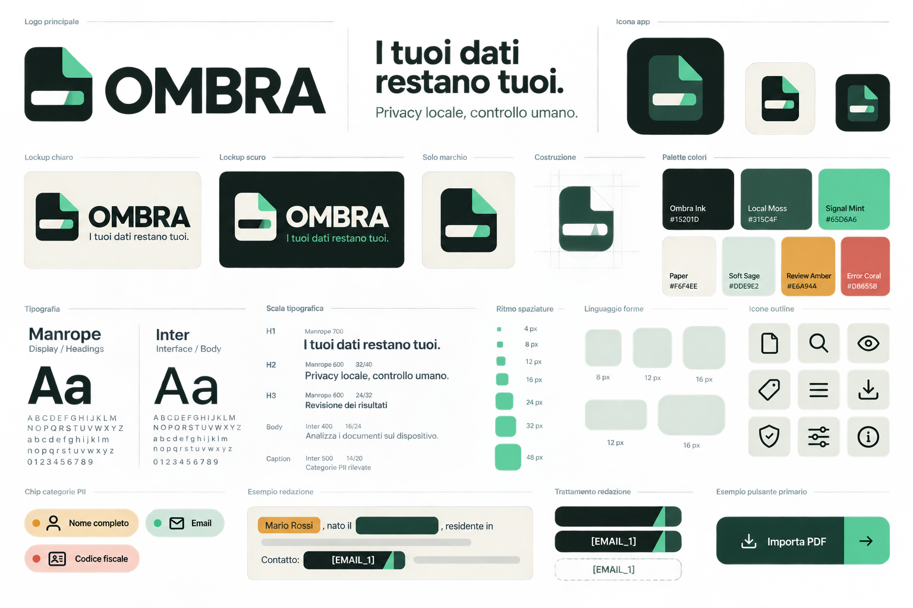
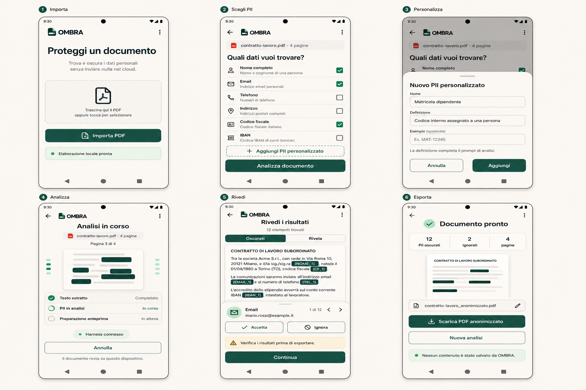

# Consumer API visual assets

Status: active
Document type: asset-index
Owner: shared-runtime-consumer-api
Canonical scope: shared-runtime.consumer-api.visual-assets
Read when: locating or replacing Consumer API reference-app mockups and generated brand exploration
Last reviewed: 2026-08-13

This directory contains visual references for the first product-shaped Consumer API application. These raster images communicate approved direction; they are not executable UI specifications, launcher masters or evidence that the application is implemented.

## Asset index

| Asset | Purpose | Status |
| --- | --- | --- |
| [`ombra-brand-kit.png`](ombra-brand-kit.png) | OMBRA identity, palette, typography, icon and redaction-treatment exploration | Reference direction |
| [`ombra-consumer-app-ux-flow.png`](ombra-consumer-app-ux-flow.png) | Six-screen PDF-to-PII-review flow | Reference direction |

## Brand kit

## Application flow

## Implementation rule

- Exact product behavior and screen acceptance belong to [`../pii-redactor/`](../pii-redactor/).
- Exact palette, typography and component mapping belong to [`../pii-redactor/ux-and-brand.md`](../pii-redactor/ux-and-brand.md) until code-owned OMBRA tokens exist.
- Production launcher artwork must be recreated as reviewed vector masters and generated deterministically; do not auto-trace or ship the raster board.
- Mockup copy and example document values are illustrative and must never be used as runtime state, fixtures containing real PII or release evidence.
- A changed visual direction requires the owning UX specification, light/dark previews, accessibility checks and applicable screenshots to move together.

Both assets were generated with the built-in ImageGen workflow on 2026-08-13 and copied into the repository for design review.
